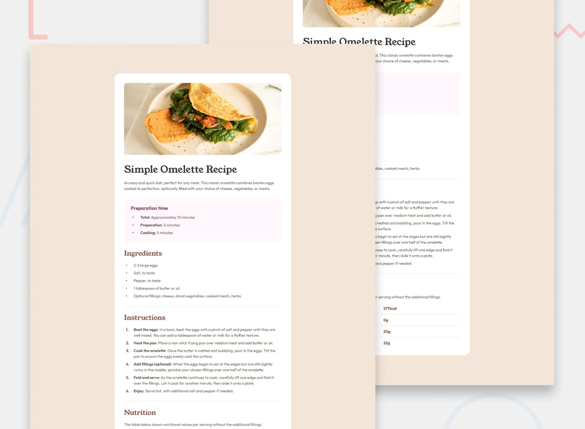

# 📌 Recipe Page

This project is a solution to the "Recipe Page" challenge on Frontend Mentor.

The challenge focuses on building a recipe page with a strong emphasis on writing semantic HTML. The goal was to choose the most appropriate HTML elements for each piece of content while reproducing the provided design as closely as possible.


## 🖼️ Preview



## 🎯 Overview

During the development of this project, the following aspects were implemented:

- Creating a responsive recipe page layout
- Structuring the page using semantic HTML elements
- Displaying recipe information in a clear and organized layout
- Creating sections for preparation time, ingredients, and instructions
- Using appropriate HTML elements for different types of content
- Styling the recipe page to match the provided design
- Applying the provided colors, typography, spacing, and visual hierarchy
- Reproducing the provided mobile and desktop layouts
- Matching the provided design as closely as possible


## 🧠 What I Learned

Through this project, I practiced:

- Structuring web pages with semantic HTML
- Choosing appropriate HTML elements for different types of content
- Organizing recipe information using meaningful HTML structure
- Creating responsive layouts with CSS
- Working with typography, colors, spacing, and visual hierarchy
- Translating a provided design into a functional web interface
- Improving accessibility and document structure through semantic markup
- Paying closer attention to HTML semantics when building web pages
- Improving attention to detail when reproducing a professional UI design


## 🛠️ Tech Stack & Concepts

- **Markup:** Semantic HTML
- **Styling:** CSS
- **Responsive Design:** Mobile, tablet & desktop layouts
- **Layout:** CSS Box Model & Flexbox
- **Interactive States:** Appropriate HTML elements for content
- **Code Formatting:** Prettier
- **Version Control:** Git & GitHub


## 🔗 Links

- 💻 **Live Demo:** https://ncticn.github.io/004-recipe-page/
- 🧠 **Challenge:** https://www.frontendmentor.io/solutions/recipe-page-html-css-IUgWO09ZPp


## ⚙️ Installation & Running the Project

To run this project locally, follow these steps:

```bash
# Clone the repository
git clone https://github.com/Ncticn/javascript-projects.git

# Navigate to the project directory
cd 004-recipe-page

# Install dependencies
npm install

# Start the development server
npm run dev
```


## 👤 Author

**Ncticn**  
Front-End Developer

- GitHub: https://github.com/Ncticn
- LinkedIn: https://www.linkedin.com/in/ncticn/
- Frontend Mentor: https://www.frontendmentor.io/profile/Ncticn


## 📝 License

This project is licensed under the MIT License.  
© 2026 Ncticn.
