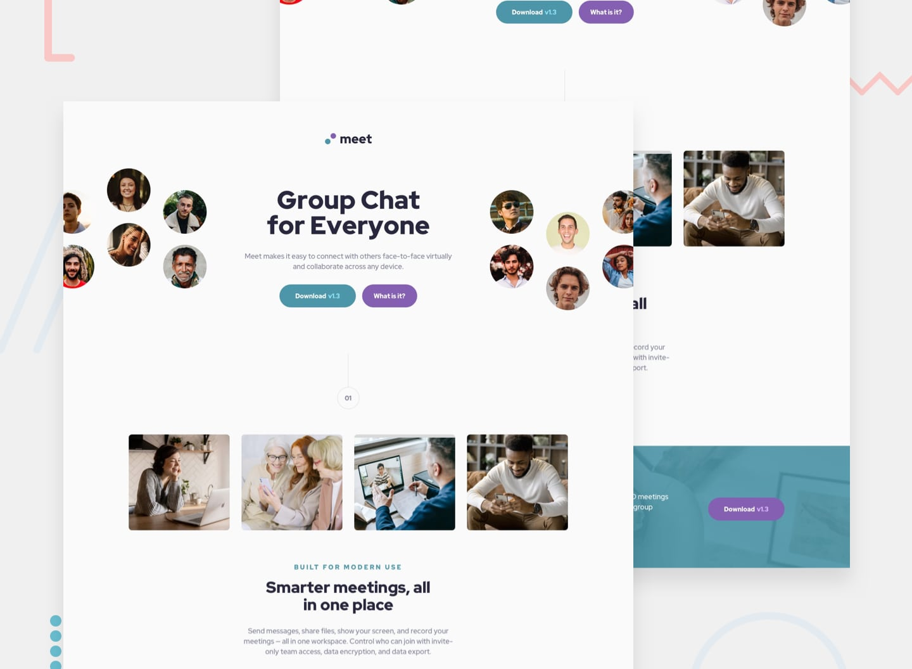

# 📌 Meet Landing Page

This project is a solution to the "Meet Landing Page" challenge on Frontend Mentor.

The challenge focuses on building a responsive landing page using HTML and CSS. The goal was to reproduce the provided design as closely as possible while ensuring the layout adapts appropriately to different screen sizes and includes the required interactive states.


## 🖼️ Preview



## 🎯 Overview

During the development of this project, the following aspects were implemented:

- Creating a responsive landing page
- Structuring the page using semantic HTML elements
- Creating responsive layouts for different device screen sizes
- Reproducing the provided mobile, tablet, and desktop layouts
- Implementing hover states for interactive elements
- Styling buttons and interactive elements to match the provided design
- Applying the provided colors, typography, spacing, and visual hierarchy
- Reproducing the provided design as closely as possible
- Ensuring the layout shifts appropriately across different screen sizes


## 🧠 What I Learned

Through this project, I practiced:

- Structuring landing pages with semantic HTML
- Creating responsive layouts with CSS
- Working with different screen sizes and responsive layout shifts
- Using CSS Flexbox for page layout and alignment
- Working with typography, colors, spacing, and visual hierarchy
- Implementing hover states with CSS
- Translating a provided design into a functional web interface
- Paying closer attention to responsive behavior when reproducing a professional UI design


## 🛠️ Tech Stack & Concepts

- **Markup:** Semantic HTML
- **Styling:** CSS
- **Responsive Design:** Mobile, tablet & desktop layouts
- **Layout:** CSS Box Model & Flexbox
- **Interactive States:** Hover & focus states
- **Code Formatting:** Prettier
- **Version Control:** Git & GitHub


## 🔗 Links

- 💻 **Live Demo:** https://ncticn.github.io/008-meet-landing-page
- 🧠 **Challenge:** https://www.frontendmentor.io/solutions/meet-landing-page-html-css-O-77n8kgyR


## ⚙️ Installation & Running the Project

To run this project locally, follow these steps:

```bash
# Clone the repository
git clone https://github.com/Ncticn/javascript-projects.git

# Navigate to the project directory
cd 008-meet-landing-page

# Install dependencies
npm install

# Start the development server
npm run dev
```


## 👤 Author

**Ncticn**  
Front-End Developer

- GitHub: https://github.com/Ncticn
- LinkedIn: https://www.linkedin.com/in/ncticn/
- Frontend Mentor: https://www.frontendmentor.io/profile/Ncticn


## 📝 License

This project is licensed under the MIT License.  
© 2026 Ncticn.
