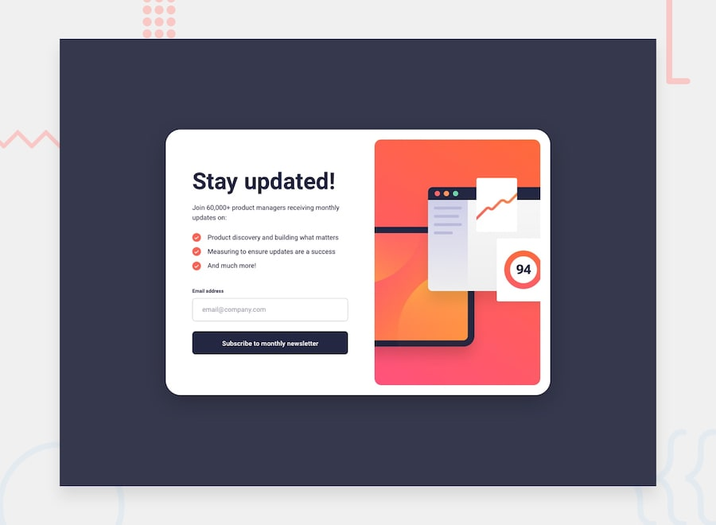

# 📌 Newsletter Sign-Up with Success Message

This project is a solution to the "Newsletter Sign-Up Form with Success Message" challenge on Frontend Mentor.

The challenge focuses on building a newsletter sign-up form with basic form structure, validation, and submission handling. The goal was to reproduce the provided design as closely as possible, show a success state with the submitted email address, and ensure the interface adapts to different screen sizes.


## 🖼️ Preview



## 🎯 Overview

During the development of this project, the following aspects were implemented:

- Creating a newsletter sign-up form using semantic HTML elements
- Allowing users to enter their email address and submit the form
- Displaying a success message that includes the submitted email address
- Showing validation messages when the email field is left empty
- Showing validation messages when the email address is not formatted correctly
- Switching between the form view and the success state using DOM manipulation
- Creating responsive layouts for different device screen sizes
- Reproducing the provided mobile and desktop layouts
- Implementing hover and focus states for all interactive elements
- Styling buttons, inputs, and error states to match the provided design
- Applying the provided colors, typography, spacing, and visual hierarchy
- Reproducing the provided design as closely as possible


## 🧠 What I Learned

Through this project, I practiced:

- Using the `novalidate` attribute on forms to disable the browser's default validation and handle it with JavaScript
- Validating email addresses with a Regex pattern
- Using `data-state` attributes to manage and style different UI states
- Learning how to use `aria-live` and `role` attributes to announce error and success messages to assistive technologies
- Using the `:placeholder-shown` pseudo-class to style inputs based on whether they are empty
- Learning how to use the `:not()` and `:has()` pseudo-classes for more flexible selectors
- Selecting elements with `getElementById`
- Navigating the DOM with `parentElement`
- Adding, removing, and toggling styles with `classList`
- Showing and hiding elements with the `hidden` attribute
- Updating content dynamically with `innerHTML`


## 🛠️ Tech Stack & Concepts

- **Markup:** Semantic HTML
- **Styling:** CSS
- **Interactivity:** JavaScript
- **Form Handling:** Form validation & submission
- **Responsive Design:** Mobile, tablet & desktop layouts
- **Layout:** CSS Box Model & Flexbox
- **Interactive States:** Hover & focus states
- **DOM Manipulation:** JavaScript event handling
- **Code Formatting:** Prettier
- **Version Control:** Git & GitHub


## 🔗 Links

- 💻 **Live Demo:** https://ncticn.github.io/010-newsletter-sign-up-with-success-message
- 🧠 **Challenge:** https://www.frontendmentor.io/solutions/newsletter-sign-up-with-success-message-html-css-and-javascript-kVaZmwqIRB


## ⚙️ Installation & Running the Project

To run this project locally, follow these steps:

```bash
# Clone the repository
git clone https://github.com/Ncticn/javascript-projects.git

# Navigate to the project directory
cd 010-newsletter-sign-up-with-success-message

# Install dependencies
npm install

# Start the development server
npm run dev
```


## 👤 Author

**Ncticn**  
Front-End Developer

- GitHub: https://github.com/Ncticn
- LinkedIn: https://www.linkedin.com/in/ncticn/
- Frontend Mentor: https://www.frontendmentor.io/profile/Ncticn


## 📝 License

This project is licensed under the MIT License.  
© 2026 Ncticn.
